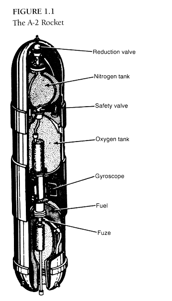

### 从A-1到A-2

　　1932年末，布劳恩在库默斯多夫开始为论文工作，即使是1934年最轻量级的项目，这时候看起来也算奢侈。他手头可支配的资源极少：

> *有一半带滑动顶棚的混凝土坑可供我支配，另一半则存放着火药火箭。我手下有一个技师。我被告知，工作命令下达给一个火炮车间，这些命令最终与其他任务一起满负荷调度运行，而其他任务的优先级大多比我的高。我的订购要求如何通过繁复的管理机构进行处理，在相当长时间内，我都没有弄清这其中的机制。这是个艰苦的开始。*

　　上文提及的技师是海因里希·格鲁诺（Heinrich Grünow），此人金属加工技术娴熟，是火箭发射场团队的老伙计。因为布劳恩缺乏大量工程知识，他的到来会对项目有所帮助，可能会使火箭引擎的实际建造工作更容易一些。

　　在库默斯多夫，布劳恩努力解决这些问题，在海兰特，平行的项目也在继续。1932年秋，军械局给海兰特的合同目标很明确：20公斤推力的引擎，因为推力要求只有1931年海兰特火箭车推力的八分之一，所以很快实验样机研制成功。这个小引擎的推重比，受到了一位未署名的军械局负责人的严重质疑，弹道军需处不得不勉力招架。这位负责人认为液体火箭技术毫无价值，因为这个引擎的推力甚至连自身都推举不起来。

　　尽管很明显，海兰特公司能造出性能更好的引擎，但可能就是因为在库默斯多夫的工作，军械局并没有积极地走这条路。1932年12月，冯·霍斯蒂希询问过200公斤推力引擎的相关情况，但是六个月后，军械局只是下达了海兰特公司曾提出的60公斤推力引擎的订单。这个动作的动机看起来是为了避免海兰特火箭团队的解散。1933年9月，引擎在海兰特的试验场测试成功。11月，海兰特提议建造一个高达400公斤推力的引擎，一处拒绝了这个提议，并且告诉海兰特别想要进一步的合同了。

　　库默斯多夫研发进度较为领先，这让军械局很满意。1934年1月，军械局进一步加强液体火箭的研发力量，他们雇佣了瓦尔特·里德尔，海兰特团队的关键工程师。里德尔比少年老成的布劳恩大十岁，有着布劳恩缺乏的实践设计经验，早在瓦里尔的独创火箭实验的时候，就已经参与研发火箭引擎。他的外号是“里德尔老爹”，从中可以窥见火箭研发团队的年轻。作为1937年佩内明德初创时的设计办公室负责人，里德尔那时35岁。

　　尽管军械局资助了海兰特公司的工作，同时还给了皮奇和鲁道夫一个小合同，但研发的主线始终在布劳恩这边。布劳恩从柏林团队的设计出发，建造了“1W”系列（W代表水冷）酒精/液氧引擎，推力达到了大约130公斤。多恩伯格的回忆录栩栩如生地记录了第一次测试时发生的爆炸，发生在1932年12月21日，差不多摧毁了整个试验架。但这与布劳恩的回忆不一致，布劳恩记录的第一次测试发生在1933年1月，且测试取得了成功。不管怎样，爆炸、泄漏和烧穿确实随后发生。重新设计的过程繁冗，完全依靠经验，改动无休无止。最终布劳恩在“1B”系列（B代表Brennstoff或者燃料），选择了再生冷却技术，然后是“2B”系列，大概到1933年秋天，推力已经达到300公斤。

　　1933年，布劳恩的项目有三个主要目标。第一，使用铝合金材料制造引擎。柏林团队已经开始使用铝材料，减轻火箭重量，提升发射性能。1933年春，多次的引擎失败困扰着布劳恩，他开始找专业人士咨询。“坚定地追随内贝尔的脚步，我拿着黄页开始电话联系，包括焊接专家，设备商，阀门制造厂和陀螺仪实验室。”布劳恩显然学到了他前任老板的创业方法。

　　不久引擎部件的制造任务就被分包给很多公司。1933年4月，布劳恩和上司们一起，与一家专业做铝材料阳极氧化[^1]（Eloxieren）的厂商签定合同，后来证明这是一项关键突破，大大增加了引擎的耐久性。这家公司一直与内贝尔合作，军械局坚持必须取消与内贝尔的一切合同。这家公司转而给布劳恩推荐了一家名为Zarges小工厂，厂址位于德国西南部城市斯图加特，未来三年内，该厂成为军械局引擎和乙醇燃料箱制造的主合同商。一开始这是一个双赢的局面，但是考虑到距离、保密和更严格的质量控制等因素，军械局决定还是在佩内明德内部进行生产。

　　布劳恩的第二个目标是实现点火以及燃料箱加压的全自动化。在合适时机点火是个重要问题，如果太多的燃料和氧化剂进入燃烧室后才点火，就可能发生爆炸。1933年末，这个问题基本得到控制，但是没能彻底解决。为了解决给燃料箱加压的问题，布劳恩做了很多试验。使用小燃烧筒（burning cartridges）增加液氧挥发，这种方法可以节省重量，但是燃料箱内出现气态的氧气会引起爆炸，给燃料箱加压必须使用压缩氮气或者液氮，这意味着又一套贮罐系统。两种形态的氮气都进行了测试，但所有关于燃料箱压力的问题都还存在。当燃料逐渐用尽时，加压气体膨胀，燃料箱内压力降低，造成往引擎中压送推进剂的速率和压力都在慢慢减弱，这意味着引擎推力的慢慢损失。还有一点，点火后燃烧室内的气压是大气压力的十倍左右，那么用来压入推进剂的气体压力必须比这个压力大，这意味着燃料箱和氧化剂箱至少需要承受15倍大气压（实测中更高），这会让燃料箱的重量增加。随着火箭的大型化，火箭结构造成的重量问题会呈指数级增加。燃料箱中压力的限制，会制约燃烧室的压力，进而影响火箭的性能，因为燃烧室的压力越大，引擎效率就越高。解决问题的方法其实很明了，这也是奥伯特和其他先行者已经讨论过的方法：必须为大型导弹研发结构复杂的涡轮泵。

　　布劳恩的第三个目标是自主设计和建造火箭。1933年6月，第一枚火箭的设计已经基本完成，代号Aggregat-1（“聚集”或“集结”），更知名的代号是A-1。火箭使用300公斤推力引擎，其特性在于保持稳定的方法，直接继承自火炮技术。炮弹或者固体火箭绕着行进轴旋转来保持稳定，但是液体火箭无法实现，因为旋转会在燃料箱和管线中产生扰动力。作为一个粗略的临时解决方案，多恩伯格提出让火箭的一部分旋转。因此，A-1的头部是一个巨大的陀螺仪靠强制力稳定（陀螺仪的旋转轴，像装在顶部一样，在空间中会趋向于保持原来的位置。如果施加外力作用，它会移动或者旋转一个角度抵消这个力。陀螺仪的抵抗进动直接与其角动量相关，角动量是质量和旋转角度的乘积）。发射前，陀螺仪靠电动马达驱动，以9000转/秒的速度在基座上旋转。飞行过程中，靠自身动量独自运转。

　　但是A-1始终没能飞起来，布劳恩有一点夸张地说： “我们花了半年时间来建造它，然后又用了半年去把它炸飞”。1933年末或者1934年初，爆炸是因为燃料和液氧阀门的耐久度不足，造成的点火时机不合适。最终，第三枚A-1成功启动，但液氧箱出现机械故障，火箭因此被摧毁。军械局决定推倒重来，代号A-2（见图1.1）。布劳恩将液氧箱与燃料箱分离，二者中间放置了陀螺转子。将陀螺移到中间的好处是火箭重心后移，当推力偏离火箭行进轴时，可以缩短力臂，增加火箭在飞行早期阶段的稳定性，因为此时火箭低速行进，空气动力极其微弱。但是在飞行末期稳定性实际上会降低，因为火箭重心接近于空气动力的中心。箱体的隔离还可以避免液氧泄漏进燃料箱的问题，这通常是由液氧箱震动破裂导致。

　　图1.1显示了早期德国陆军火箭的典型特性，引擎实际上被乙醇燃料箱包裹，这可以缩短火箭的长度，在燃烧室很长的情况下，还可以冷却引擎。为了将一滴一滴的推进剂进行适当的雾化和挥发，布劳恩团队不得不设计越来越长的燃烧室，推进剂可以混合更长时间以便完全燃烧。不完全燃烧是引擎表现不佳的主要原因，300公斤推力引擎的排气速度可以达到1500米/秒，而75%乙醇/液氧火箭的理论最大排气速度可以略超2000米/秒，燃烧室压力会达到10到13个大气压。根据火箭方程，排气速度是影响火箭表现的关键因素。排气速度越高，火箭表现越好。不妨做个比较，现代太空梭主引擎的排气速度在4500米/秒左右，使用液氢液氧，燃烧室压力达到200个大气压。在A-1以及重新设计中必须解决的问题造成了项目进度的延期。1934年4月，布劳恩完成论文，此时距离A-2完工还有好几个月。这些技术挫折并不罕见。在一年半的时间里，年轻的物理博士研究生布劳恩，和他的几个助手一起，将现有的业余火箭技术远远甩在身后。军械局的强制推行的系统举措功不可没，但是布劳恩的才干也同样是关键因素。1934年6月初，布劳恩论文答辩，组长是舒曼，答辩委员会对他的工作评价很高。论文主题涉密程度很深，论文题目都是机密，布劳恩的论文用的是假标题：“燃烧相关实验”。

　　稳定增加的资源投入是库默斯多夫技术发展的另一个关键因素。在1933-34年，火箭项目的规模小经费少，但随着纳粹重整军备，贝克尔的将星随之冉冉升起，火箭项目获益匪浅。贝克尔培养了与希特勒、陆军高层的紧密联系，1933年9月，希特勒访问库默斯多夫，在这期间或者之后，元首承诺了比军械局期望更多的资源投入。舒曼的研究部门扩展为测试部下属的处室，也开始从事火箭研发。舒曼有一个学生叫库尔特·瓦姆克（Kurt Wahmke），在布劳恩之前毕业，1934年春，他参与试验，使用过氧化氢作为氧化剂。在一次粗心的实验中，瓦姆克将过氧化氢与乙醇混合，尝试制造预混合的单推进剂。实验发生了爆炸，他和两个助手身亡。

　　1934年末，A-2最终准备完毕。两枚A-2被船运到北海博尔库姆（Borkum）岛等待发射，火箭被分别命名为“马克思”（Max）和“莫里茨”（Moritz），这是德国版的连载漫画《捣蛋鬼》（The Katzenjammer Kids）中两兄弟的名字。出于安全和秘密的考虑，军械局选择了这个岛作为发射场。12月10日，布劳恩、里德尔以及其他四人上岛，随后是施耐德和不晚于1933年中期加入一处的灿森。鲁道夫在最终通过保密审查后加入团队，并带着液氧箱上岛。10月1日，多恩伯格被轮换到了固体火箭火炮部门，限于职责无法脱身，因此不能参加发射。他的运气太差了，因为无制导11厘米口径固体火箭也要在博尔库姆测试其潜在的防空能力。

　　12月19日，12米高的A-2发射台和所有的测试照相设备都已就位。只有天气状况不太配合，北海天气寒冷，刮着七级的大风。但圣诞节临近，可用的时间不多了，还是进行了第一次发射。“马克思”表现完美，引擎工作16秒钟，高度达到1700米，然后大风造成火箭进动，进而倾覆。火箭在800米外的沙滩中被发现。第二天凌晨“莫里茨”表现同样完美，这是一个令人高兴的开始。

　　伴随着A-2的发射，德国陆军液体火箭项目完成了第一阶段的研发。从开始时的前途未卜，作为火药火箭边缘化的小活动，演变成一个成功的研究项目，制造出了当时德国最先进的火箭。随着纳粹的掌权，在航天浪潮以及业余火箭团队中成长起来的有才干的工程师，大部分都被军械局网罗至麾下，军械局理想中的严格保密状态也有了强制施行的可能。“一个屋檐下解决所有问题”是军械局火箭研发的行事哲学，保密是这一哲学的基石。未来很明朗，细节稍有模糊：建造射程达数百公里的大型火箭完全可行。为了实现这一目标，帝国将不得不极大地增加资源的投入。

译注：

[^1]: 通过电解工艺生成氧化层增加铝材料表面的硬度。　　