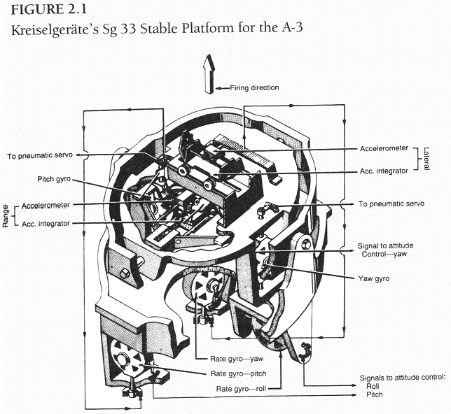

### 成功的失败：A-3

　　1935年后发生的重要事件，包括联盟的兴起和衰退、火箭飞机的实验、佩内明德的建立、A-4的提出，似乎掩盖住了库默斯多夫和佩内明德工程师们的主要工作，即推进了军械局火箭系列及其相关技术的研发工作。1934年12月，A-2成功试射之后，陆军就开始酝酿一个大计划。A-3不仅仅尺寸要巨型化，推力也必须有飞跃，最重要的是研发有效的制导系统，以代替目前只用单个陀螺仪进行测量的权宜之计。

　　规划中最为明确的部分，即研发新的“3B”系列1,500公斤推力引擎。将A-2等比例放大，焊接在乙醇箱内部的是一个长长的圆柱形的燃烧室。燃烧室设计得很长是为了使燃料充分燃烧，酒精注入前流经双层的燃烧室壁，可以有效地进行再生冷却。在瓦尔特•里德尔的影响下，注入系统采用了类似于海兰特引擎的设计。在“2B”引擎中，继承了火箭发射场团队的设计，燃料和氧化剂喷嘴一一相对；“3B”引擎设计有有一个蘑菇状的喷嘴，倒挂在引擎上部，酒精从蘑菇伞下向上喷雾，而液氧从引擎上方的数个注入孔中往下喷。这项创新使燃烧更加充分，提高了火箭性能，排气速度从1600m/s提高到1700m/s。同时，这又提高了燃气的温度，加剧了冷却问题。

　　团队唯有一轮又一轮地地试验不同的铝合金材料，改进引擎的基础设计。1935年夏秋，钢结构的1,500公斤引擎试车成功，库默斯多夫团队开始试验铝合金引擎和燃料箱，由斯图加特的Zarges以及其他几家公司秘密加工。1935年初，保密程度已经很高，供货商被要求送货给鲁道夫名下的影子公司，地址位于库默斯多夫旁的小镇，没有使用军方的地址。运送遍布各地的秘密组件，偶尔还需要返厂维修，这些不便之处，使得陆军在规划与建设佩内明德时，就决定将制造业集中到鲁道夫的车间。另一项原因是，主要的合同商Zarges是在斯图加特的小企业，缺乏熟练焊工完成不同合金间精细的焊接工作，当然，在别处有这种能力的企业很少。这些经验强化了军械局团队“一个屋檐下解决所有问题”的观念。

　　相比之下，设计和建造一个基于陀螺的三轴制导系统已经超出了军械局的能力。面对这样的情况，军械局不得不将难题外包给公司解决。1933年到1934年初，海军推荐火箭团队联系主要业务在柏林的Aerogeodetic公司。1926年，海军秘密收购了这家荷兰公司，并且利用其为秘密任务打掩护，尤其是研发重型舰艇用陀螺航海以及火控系统。纳粹掌权后的一至两年，该公司更名为Kreiselgeräte GmbH（陀螺设备有限公司），放弃了在荷兰用作掩护的总部。

　　公司的灵魂人物是技术总监Johannes Maria Boykow（1879-1935）。显然，布劳恩对此人的印象极其深刻：

> *Boykow是我遇到过的最奇怪也最具魅力的人。他是前奥地利海军军官，周游过世界，还知道如何纺线。一战前，他退伍成为一个喜剧演员。战争爆发后重入军籍，当过驱逐舰舰长，海军航空兵，还参与了鱼雷的研发。正是研发中遇到了困扰他余生的陀螺仪问题。他申请了数百项专利，渐渐成为了（德国）海军陀螺罗经和……火控领域首席专家。他是个真正的天才，但……，对于他的发明，他并没有太在意世俗的工程阶段。公司的设计部门经常发现不得不偏离他的原始构想，因此最后的产品只是隐约聚集了他的原始提议。不幸的是，在遭遇严重挫折后，我才发现了这一点。当我第一次遇到Boykow，我被他敏锐的分析和想象力震住了，作为他在陀螺领域的副手，我采纳了他的一切意见。*

　　1934年10月，Boykow开始设计后来用在A-3上的制导系统。他曾经在Kreiselgeräte之外的项目中研发飞机自动驾驶系统，对于此项任务，他可以利用这方面的经验。但一年多以后，他就去世了，只能把项目留给公司去完成。

　　1936年中，先期一轴稳定的实验室试验完成后，Kreiselgeräte组装了后来称为“Sg 33”的第一个版本。它在A-3中的最终定型版如图2.1所示。Sg 33有一个功能是，简单地将火箭位置保持在垂直方向上。事后看来，对那时的技术来说太复杂了。两个陀螺仪让平台保持水平。当火箭俯仰晃动（箭头前后晃），或者横向晃动（偏航）的时候，以20,000rpm高速旋转的陀螺转轮，在物理定律的支配下，会转过正确的角度（进动）。电触点感知到这些移动后，将从小喷管中喷出氮气将平台调整归位（和后继型号不同，本版本的平台陀螺不能直接调节火箭姿态）。平台顶部有两个设备，测量火箭在水平方向上与初始垂直轨道的偏移。较为原始的加速计使用了带轨道的小车，将水平加速度转为可测量的水平速度，然后送往火箭的控制系统。平台下部是三个“速率陀螺”，他们的功能是测量火箭在特定方向上的转向速率，分别是俯仰，偏航和滚动（沿着纵轴转）。系统使用速率陀螺的信号，使火箭保持初始的垂直状态。

> *译注。本节技术细节有点绕。降落伞的弹出原因：上部的稳定平台只装备了俯仰和偏航陀螺，如果箭体转动时，平台无法纠偏，而转速超过每秒六度，平台就会翻倒，造成降落伞弹出；本来系统是可以依靠平台下部的roll速率陀螺来侦测并控制旋转，但喷气舵无法产生足够强的控制力。而这也是箭体风中转向的原因，速率陀螺堕落侦测到了俯仰、偏航或旋转，但控制系统无力纠偏。*

 　　由轨道小车和速率陀螺发出的命令产生的控制力，将控制位于火箭排气口的喷气舵，造成喷气方向的偏斜，这个设计由奥伯特和其他先行者提出（戈达德早在1932年就在新墨西哥城实现了喷气舵和简单的陀螺系统）。但是寻找能够耐受喷气高温和腐蚀的材料很困难，在承包商的协助下，经历了数百次的测试失败后，库默斯多夫团队最终发现了钼钨合金的叶片能够满足要求。制导系统的电动机位于A-3顶部，从这些电动机延伸下来的传动杆带动叶片旋转。

　　长条状尾翼也能让火箭保持纵向稳定，更形象的德国术语表达为：“箭状稳定”。它们可以保证火箭围绕重心俯仰或偏航时，尾翼产生的升力可以迫使火箭回到原来的位置，迎头进入气流，所以这种尾翼具有天生的空气动力稳定性，就像箭一样（用技术术语表达就是，尾翼保证火箭的风压中心在重心之后）。设计合适的尾翼的形状是另一个难题，空军正好能够提供帮助。1935年末，技术办公室将国内为数不多的一个超音速风洞团队介绍给布劳恩，地点在亚琛技术大学（Technical University in Aachen），毗邻荷兰与比利时边界。大学的助理教授鲁道夫•赫尔曼博士，设计了初步的抓取测量方法，用来计算火箭的性能。紧接着，他测试不同的尾翼形态，保证火箭从静止一直到超音速下的稳定性。

　　1937年12月初，比布劳恩的估计晚了一年，四枚A-3最终整装待发。他们体积都很大：长6.5m，直径0.7m。加注燃料后重750公斤。每枚都搭载了记录设备，从最高点20公里处打开降落伞下降后，测量表面温度，摩擦、空气温度和压力。发射场就在距离佩内明德几公里离岸小岛——格赖夫斯瓦尔德之岛，岛上悬崖陡峭。讽刺的是，1929年，奥伯特申请在这里发射他的 *月中女神* 版火箭，被普鲁士当局拒绝，理由是可能危及岛上的灯塔。但在第三帝国，来自军方的申请是不太可能被拒绝的。

　　改造小岛成为了陆军的主要工作以及支出，因为岛上除灯塔之外，唯一剩下的只有承租人管理的农舍和客房。幸运的是，当初造灯塔的时候，留下了一段小型铁路，因为岛上根本没有路。装载液氧箱的卡车上岛后，发射组需要花费数小时将它拉出泥坑。陆军基建办公室新建了船坞，发射坑，发电机房和零时兵营。建筑之间拉上了电话线，树荫下搭起来了大帐篷用作工作区，租用了一条老旧渡船，用来从陆上运设备。

　　临近11月底，佩内明德和柏林方面挑选出了大概120人，由多恩伯格、灿森和布劳恩领头，赴岛进行“灯塔行动”。自A-2成功后项目发展迅猛，参加行动的大多数人都是第一次参与发射。条件艰苦但热情高涨。天气状况不佳：雨连续下了很多天，发射不得不推迟，气温变得寒冷，大风几乎要把帐篷吹个底朝天，“茫茫多的老鼠”在咬坑道的柏油纸，声音一直清晰可闻，十天后雨渗进来。更可恶的是田鼠忽然对电缆绝缘层胃口大开，造成了设备短路。技术原因造成的延迟考验着观摩发射的高层人士的耐心，对发射组也造成了一定的困难，因为发射借用了大量设备：空军的飞机，海军的舰船，军械局其他部门的拍摄和测量设备。

　　12月4日上午10点，团队最终开始发射第一枚A-3，出于爱国因素取名“德意志”。最初三秒，火箭垂直上升，然后降落伞忽然弹出，拖在了还在上升的火箭后边被烧成了灰。火箭在风中转向，由于摆动太大，引擎自动停止了工作。20秒后，火箭一头栽回岛上，发生了剧烈的爆炸，落点距离发射点大概300米。多恩伯格写到：“目击者的说法互相矛盾，每个人都说自己看到不同之处，我们决定冒险进行第二次发射。”两天后，第二枚A-3发射，发生了几乎同样的事情。火箭摔在了离海岸5米的地方。降落伞很清楚地打开，只能怀疑是爆炸螺栓有问题。12月8日，第三次试射拆掉了降落伞，用信号弹代替。风比前两次试射时更大，火箭快速升空，4秒后信号弹发射。引擎再一次自动关机，火箭摔在了离岸两公里的海里。12月11日，最后一次的试射结果相同。

　　试射结果令人震惊和沮丧，这些情绪在冗长的延迟过程中已经存在。多恩伯格、布劳恩和其他工程师全力寻找问题。最初的关注方向是火箭表面积累的静电导致了降落伞螺栓的打开。但是12月末，地面测试表明静电并不是主因。A-3在风中转向而不是保持垂直姿态暗示了控制系统太过无力。火箭看起来过度稳定，尾翼让风压中心后移过多，喷气舵功率不足以对抗空气动力。控制喷气舵的伺服马达看起来也缺乏足够动力，这是技术尚不成熟的体现。

　　虽然发现了控制系统太弱和火箭过于稳定，但这两个问题都无法解释降落伞/信号弹每次弹出的现象。1938年1月，在反复重放发射录像，地面重复试验以及与Kreiselgeräte讨论后，问题才渐渐清晰。Sg 33制导系统的阿喀琉斯之踵在于，不能阻止A-3的快速滚动。究其原因，简言之，稳定平台无法纠偏垂直轴，也没有滚动陀螺来感知火箭在垂直轴上的转动。如果火箭旋转超过每秒6度，旋转造成的进动施加的力将超过平台陀螺能够做出的修正。而陀螺的运动范围限制是30度，当某个陀螺超过了这个限制，它会往回偏倒，这时平台就会翻转，失去控制火箭的能力。弹出降落伞的电路正好连接平台，当初的设想是火箭到达轨道最高点才会开始转向，并带动平台翻倒。最根本的瑕疵还是喷气舵产生的控制力远远不够，无法执行滚动速率陀螺在滚动轴上的纠偏指令。不对称的尾翼，加上大风，让火箭开始转动，产生远超控制系统的力。四次试射中，每次发射后三四秒钟，火箭就因快速转动造成平台翻到。

　　因为缺乏经验，军械局团队和Kreiselgeräte都未能预见到这个问题。Kreiselgeräte的专长在于重型舰艇，机械局的工程师只能依赖Kreiselgeräte以及Boykow的原始设计。排除掉对这个故去的发明家的个人欣赏，布劳恩认为在制导系统中必须投入更多的力量和资源，并且项目中也需要引入竞争机制。多恩伯格及下属也改变了A-2发射后，不需要频繁试射的看法。新火箭A-5（因为A-4已经在编）被用来专门测试发射后制导系统的性能，取代库默斯多夫那种只在地面测试架上测试的做法。A-3的过稳定的问题也证实了当初的印象：即亚琛的风洞测试远远不能全面分析飞行中火箭的受力情况。A-3项目中只有引擎系统工作正常，但是A-4的25吨推力引擎是一个跨越，还需要巨大的资源和系统性的工作。从舒曼的研发处调来蒂尔，以及佩内明德的建设，A-4算是正式开始起步。

　　1936年出现的趋势，因A-3的失败得到确认和增强。在研发如弹道导弹这样划时代的技术时，如果一些关键技术需要突破，项目需要花更多的钱以及招募更多的专职专家。A-3系列，是布劳恩后来称之为“成功的失败”的象征。这次试验为团队积累了很多经验，而在30年代末，政治环境以及预算倾斜的条件下，可以说技术问题几乎一定能够攻克。而在1936年到1941年，陆军军械局将一直致力于这些问题。
