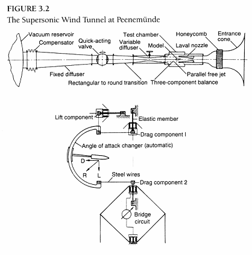

### 库尔茨韦格，赫尔曼与超音速空气动力学

　　产生足够的动力驱动导弹飞行数百公里，并不意味着能够在4.5马赫的速度下实现稳定制导。1935年，当布劳恩开始研究A-3的的最佳气动外形时，他对尾翼稳定飞行物的超音速气动力特性基本一无所知。以贝克尔及其导师卡尔•克兰茨为首的弹道学专家们，曾经试验过高马赫下自转的来福枪子弹以及炮弹，而A-3的外形也确实仿照了步兵“S”子弹，因为这种外形能够在高马赫下工作。但也有一些火炮专家认为，超音速飞行物不可能利用尾翼进行稳定。

　　陆军弹道学家的陈述表明，他们与空气动力学圈子毫无联系。这个圈子1933年前由交通部资助，后由航空部接手。这两拨人的兴趣点没有交集，因为空气动力学专家们的研究领域集中在机翼和航空器的低速表现。但从20年代末开始，在元老级动力学专家哥廷根（Göttingen）的Ludwig Prandtl教授的指引下，有翼飞行器在超音速或高亚音速下的运动理论开始取得突破，在这种情况下空气被严重压缩。这时候利用小型超音速风洞的试验已经开始进行，尽管瑞士建造了首座风洞，但德国在这个领域占据着主导性位置。1935年，根据在哥廷根和德累斯顿取得的风洞测试数据，后起之秀阿道夫•布泽曼（Adolf Busemann）博士首次指出，后掠翼在近音速或者超音速时的表现远优于直翼。后掠翼延迟了在接近音速时的紊流（音障）的发生，在高速情况下有更好的升力和牵引力表现。当时此发现并未得到空气动力学家的关注，因为看起来这个理论无法应用于实际。

　　同时，因为逐渐展开的火箭飞机项目，布劳恩开始与布泽曼以及空气动力学社区联系。1935年，在航空部的帮助下，已经有少量的A-3风洞试验开始进行，1936年1月8日，布劳恩访问亚琛工业大学之后，双方开始正式合作。布劳恩与助理教授鲁道夫•赫尔曼（Rudolf Hermann）博士会面，赫尔曼在空军财政支持下建设过一个超音速风洞。这个风洞用来测试的区域，也就是放置航空器和导弹模型的地方，是边长10厘米的正方形。风洞的最大速度为3.3马赫。1936-1937年初，赫尔曼在这个速度下对A-3做了基本测试。因为使用的模型很小，他的任务只是对现有设计进行修正。通过增大后掠翼，A-3实现了“箭式稳定”，但是这离理想形态还很远。一旦A-3升到高空。降低的大气压会让喷气扩张，进而烧毁尾翼或者尾翼周围的天线环。在实际的飞行测试中还发现A-3过于稳定，制导系统将火箭拉回指定姿态非常困难，因为空气动力在这时拥有压倒性优势。

　　1937年12月，远在这些发射中才会遇到的问题被发现之前，布劳恩已经指出，如果想在A-4上有所突破的话，火箭团队应该有自己更复杂的超音速风洞。去亚琛很不方便，而且亚琛的风洞太小，使用也得不到保证。这些航空研究设施由航空部管理，在战争早期，航空部的大量投资还未能取得成果，现有风洞的预约排得非常满。

　　多恩伯格同意了布劳恩建设新超音速风洞的提议，这符合新佩内明德“一个屋檐下解决所有问题”的理念，但“花费惊人，预算30万马克，我的建设工程经验告诉我，这不可能是最后花费的数字，特别是布劳恩负责的项目，超音速风洞最后可能会花100万马克。”但1936年秋，赫尔曼展示了他能够在超音速状态下让A-3保持稳定，多恩伯格决定开始行动。他找到了贝克尔，然后是测试部主任，提出建设风洞的要求。贝克尔的条件是，至少有一个别的部门也需要这个风洞。有趣的是，多恩伯格无法得到一处（弹道军需处）的支持，虽然他的火箭团队刚刚从处里独立出来，但他让防空火炮部门的负责人相信，炮弹外形可以在风洞中得到优化。1936年11月30日，贝克尔签发了建设命令；1937年4月，鲁道夫•赫尔曼加入了佩内明德。

　　这位32岁的空气动力学专家，多恩伯格形容为：“瘦瘦的，额头很高，浅褐色微卷的头发笔直地朝后梳”，是个才干活力并具的工程学家。根据美国的记录，在之后的战争年代里，他是个“极端热忱的纳粹分子”，虽然他直到1937年纳粹重新开放后才加入。多恩伯格和布劳恩从学术界招募了赫尔曼，无疑有其爱国的因素，但更看重的是他的追求：他有机会造出世界上最先进的超音速风洞。赫尔曼立即招募了一名助手，开始了建设规划。“空气动力学研究所”的中心位于佩内明德东，在实验室和车间区域的中间地带，佩内明德风洞将是一个亚琛10\*10cm风洞的放大版本，测试区域边长达到40厘米，最高风速达到4.4马赫。二战结束前，这个指标并列世界第一。

　　佩内明德风洞的规格和原理如图3.2所示。这是一个开放或者说“往下吹”的类型。风洞有一个直径约12.5米的球状真空罐，由六个泵共1100马力抽成真空。快速反应阀门打开后，空气快速进入，在20秒内充满真空罐，这是一次试验的最长时间。测试区的空气速度取决于“拉伐尔喷管”开口的形状和大小，这是空气流的必经之地。一个“三组件的平衡系统”测量模型受到的升力以及牵引力，模型周围的气流模式可以由精密的光学设备测量或者照相。同时建造的还有一个稍小的18\*18cm风洞，连接到了同一个真空罐上。通过持续抽气，风洞可以无间断工作，但产生的马赫数会稍小。

　　规划和建设这个顶级设施花费了很长时间，因此，赫尔曼和他的团队必定承受了军械局巨大的压力。直到1939年5月，大风洞才投入使用，小风洞的完成时间更晚。即便如此，风洞开始也遇到了无数的困难。拉伐尔喷管的设计决定了马赫数，其有着巨大的理论复杂性，需要艰苦的试错法进行修正。到了1941年初，3.1马赫的喷管还需要完善，最高的工作速度是2.5马赫。4.4马赫的喷管直到1942年或者1943年才完成。另一个问题是凝结云现象，因为空气在通过喷管的咽喉部位后，体积快速膨胀导致冷却。为了取得精确的结果，必须在喷管的入口部位部署特制的蜂窝状干燥剂，用来除湿。在1940年春这个设计完成之前，测量结果的可靠性大打折扣，这降低了赫尔曼设备的有效性。

　　在佩内明德建设这个世界级的空气动力学研究所，是发展内部研发能力的另一项巨大进步。1939年研究所有60名员工，1943年增至200名。风洞项目的延期，意味着A-4空气动力方面的关键创新都是在推测和不严谨的实验中得到的。1938年，团队决定建造一个用来测试制导系统的新型号（A-5），火箭外形的问题再一次变得紧迫。赫尔曼和他的团队将不得不面对两个问题：尾翼的设计以及火箭突破音障时箭体的稳定性。

　　在设计A-5的时候，箭体的外形不是问题。因为A-3的外形设计已经是深思熟虑，而且无法进行扩展风洞测试，A-5的箭体只是稍微加宽，然后A-4也依样画葫芦。相比较而言，没有人知道如何设计超音速飞行器的尾翼。1937年，赫尔曼被吸引至佩内明德，他的首席助手和研发负责人是赫尔曼•库尔茨韦格[^1]（Hermann Kurzweg）博士。此人是赫尔曼的老朋友，毕业于莱比锡大学，后来在著名的光学公司Zeiss工作。从1934年开始，库尔茨韦格是一个不活跃但有贡献的党卫队成员。1938年初，他开始着手解决A-5的尾翼问题，手头知识储备有限：超音速空气动力学原理，箭体上压力分布的粗略估计，以及关于平碟型物体的风洞数据。（另一层考虑是多恩伯格的禁令，扩大到A-4比例的尾翼必须能够通过标准的铁路隧道）。高空气压很低，为了适应高空喷气的膨胀，库尔茨韦格设计的A-5尾翼后部张角比A-3大很多。为了高音速下的表现，他将后掠角度大大增加，使尾翼相对较薄，但还是比A-3的尾翼厚。这就是A-4首项空气动力学创新，一个像后来照片展示那样的宽尾翼。

　　缺乏快速验证这个设计的手段，库尔茨韦格采用了一个土办法。某周末，他用松树枝刻了一个火箭箭体，在箭体上的小孔中填充重物来平衡重量，安装上预定外形但尺寸不同的三个硬橡胶尾翼。为了得到低速下的稳定数据，他试着从屋顶上把火箭扔下去，结果不令人满意，他把用线穿过模型的重心，然后开车拖着模型以100公里的时速驶过柏林-安克拉姆（Berlin-Anklam）高速公路。最大和次大的尾翼稳定性还不错，但最小的不行。空气动力学团队手中有了可以稳定工作的A-5。1938年，风洞测试在亚琛完成；1939年，亚音速测试在齐柏林（Zeppelin）飞艇制造公司完成，地点在腓特烈港（Friedrichshafen）的博登湖（Constance Lake）。1938年10月，格赖夫斯瓦尔德之岛，A-5的第一次无制导发射采用了库尔茨韦格的尾翼设计。在进行了微调后，该尾翼也用在A-4上。

　　在空气动力学团队的设计能够确定前，有必要进行更系统性的尾翼外形测试。连同1938年的A-5发射，为了锻炼发射的组织协调以及展示火箭的空气动力稳定性，佩内明德东使用很多不同尾翼形状，配备小型瓦尔特过氧化氢引擎的模型进行空中实验。这些模型测试的准确动机未知，但最可能的解释是：测试部11处提出的无制导对空导弹方案。结果令人鼓舞，1939年3月，气动团队发射了40枚等比例缩小并使用过氧化氢引擎的A-5火箭模型，模型高1.6米，使用了8种不同形状的尾翼。发射进行了系统地拍摄，结果确认库尔茨韦格的原始设计具有亚音速下最好的性能表现。后来在佩内明德以及齐柏林进行了更多的风洞测试，将研究扩展到了全速度范围，A-4的外形得到进一步改良。库尔茨韦格从一开始就走在了正确的道路上，这是其能力的体现。

　　另一项关键性创新是寻找让A-4和A-5在突破音障时保持稳定的方法。1940年以前，没有风洞能成功制造出0.85马赫和1.2马赫之间的速度，跨声速领域的理论还保持着相对原始的状态。通过某次不太可靠的0.95马赫测试（可能在亚琛进行），赫尔曼得到了一些线索。A-5的风压中心可能会相对重心大大前移，火箭无法保持稳定，会翻倒并失去控制。为了取得这方面的数据，1938年赫尔曼提出，把一个铁质模型从7000米高空的飞机上扔下，在离地面1000米的地方，模型会突破音障，这时候可以从地面精心拍照，并进行空中观察。

　　这些测试的开始时间不会晚于1939年秋季，测试使用了佩内明德西空军的He 111轰炸机。1939年末，制导团队新招募的成员瓦尔特•霍伊瑟曼（Walter Haeussermann）博士，在布劳恩驾驶的第二架观察机上目睹了掉落测试。模型从He 111上释放之后，布劳恩驾驶观察机紧随其后，观察模型行为并将入海点电告复原团队。最后，高空释放实验排除了A-4/A-5的穿越音障会发生严重不稳定问题的担心，但也并不是说没有问题。事实上，1939-1942年A-5的反复发射，显示了火箭在穿越音障时处于临界不稳定状态。火箭头部会作圆周状暴动，弧度很小，造成的牵制力使火箭突破不了音障。因此1942年，A-4第一次试射时，气动团队和其他人一起，交叉手指祈祷在突破音障时，控制系统能够阻止一切可能的危险运动发生。

　　因此情况很清楚，佩内明德的风洞对于A-4的基础外形并不是必须的，但是如果要设计高性能的气动外形必须使用风洞。尽管如此，1940年在风洞中进行的系统性的工作，与齐柏林的Max Schirmer博士的亚音速实验一起，很大程度上完善了火箭的设计，也排除了很多隐患。火箭团队研发A-3和A-5时，对空气摩擦产生的高温一无所知，但这个问题在A-4上变得非常急迫，因为A-4的速度大大增加，必须保证火箭在到达80公里的轨道最高点，重入大气层时不会被烧毁。佩内明德的气动专家使用简单的形状和火箭模型，在其中安装温度传感器，用风洞进行了基本的热交换研究。这些数据帮助验证了理论计算值，并为设计者后来使用钢材料指引了方向。模型沿纵向切成两半，可以安装更多的传感器，对压力进行精心测量。这些方法验证了先前预估的表面负载，这些数据对结构设计工程师非常重要。佩内明德取得突破的另一个新领域是：评估引擎喷气对火箭气动外形的影响。将压缩气体从模型尾部喷出，团队发现在亚音速状态牵引力增加，但在超音速状态下牵引力减小。缺乏这个信息，A-4发射无异于盲射。

　　与推进相比，特别是制导和控制系统，大学的贡献在战争开始后减弱了。所有的气动学家都在为航空部工作，这是部分原因，但佩内明德的学术合同商还是有几点珍贵的理论创新，他们建造或者完善了风洞的测量方法。企业的研究，以齐柏林的Schirmer的工作为典范，相对更加重要，尽管相对不起眼。在飞艇的最后时代，由于兴登堡号事故的影响，以及希特勒和戈林不喜欢这种脆弱航天器，为火箭项目使用齐柏林公司的气动设施开启了大门。

　　齐柏林最重要的贡献，与佩内明德的超音速工作协同，是对于有翼导弹的新研究。1939年6月，里德尔设计部的Kurt Patt提出，A-4类型导弹在命中目标前的高能量可以被用作产生气动升力。通过使用翼，A-4的射程可以倍增至550公里。这个想法后来被称为A-9，很快为布劳恩团队采用，因为这个方法可以相对廉价地增加25吨引擎驱动导弹的射程。Patt的设计是一个没有机身的飞行翼，这非常激进，但安装类航空器的机翼是可行的选择。这个理念需要超音速飞机配置的基础研究，可以像导弹一样推进升空，然后像滑翔伞一样下降。到1941年，有了一个可行的方案：简单后掠翼。团队也尝试了更激进的机翼方案，最后是一个折中的方案，在一切速度下都可以工作但很复杂。A-9的实验一直持续到1942年，直到被更高优先级的项目取代。在战争的最后几个月，项目又以A-4b的代号重启研究。

　　滑翔导弹项目的一个显著性质，就像在A-5/A-4中一样，需要反复进行系统性风洞测试，评估不同马赫数以及不同攻角时（火箭头部与气流方向的夹角）的设计。在半模型中进行复杂的压力测试，举一个极端的例子，二十个人两班倒工作了两周，手动记录了超过10万条计量数据。当佩内明德的攻关进行时，气动研究的固有特性，加上完成A-4的紧张政治压力，工作流程越来越紧张，按部就班和工厂化。第二个40\*40的测试单元也建造完成，这样一台有改动的时候，另一台可以继续工作。气动团队多班倒，几乎全天候的工作。作为导弹研发的补充，军械局炮弹研究也有收获，包括内部设计使用尾翼进行稳定的“佩内明德箭状抛射物”。

　　研究工作的丰硕成果，增强了一个基准点，使佩内明德在1936到1941年，在关键技术上取得革命性突破。和推进技术相似，对于气动技术，天才的理念和优秀的管理并不足够，只有依靠大型和资金充足的组织机构，火箭团队才能在短时间内研发出可用技术。整个项目中难度最大的挑战：制导和控制系统，更清晰地显示了这一点。

[^1]:  Hermann Kurzweg: (1908-2000 ) 1933年，莱比锡大学毕业。在佩内明德为V-2以及瀑布防空导弹进行气动力研究。战后为美国海军工作，后加入NASA。