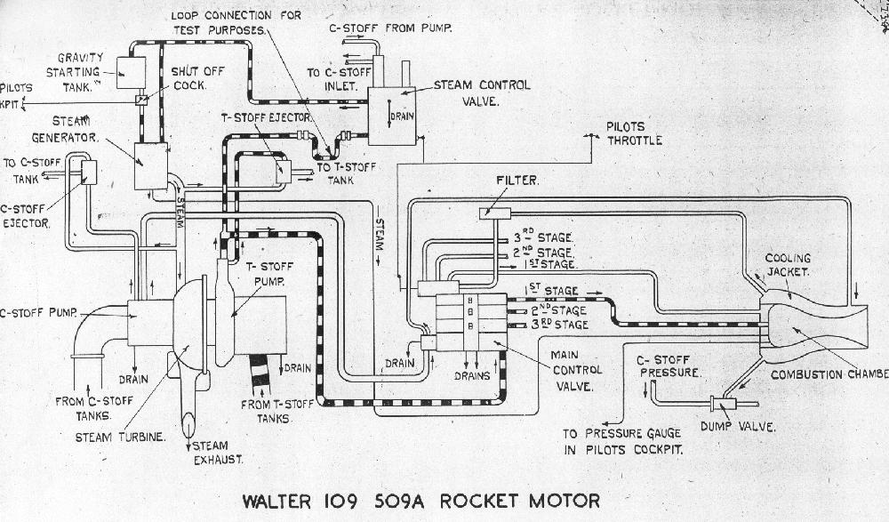
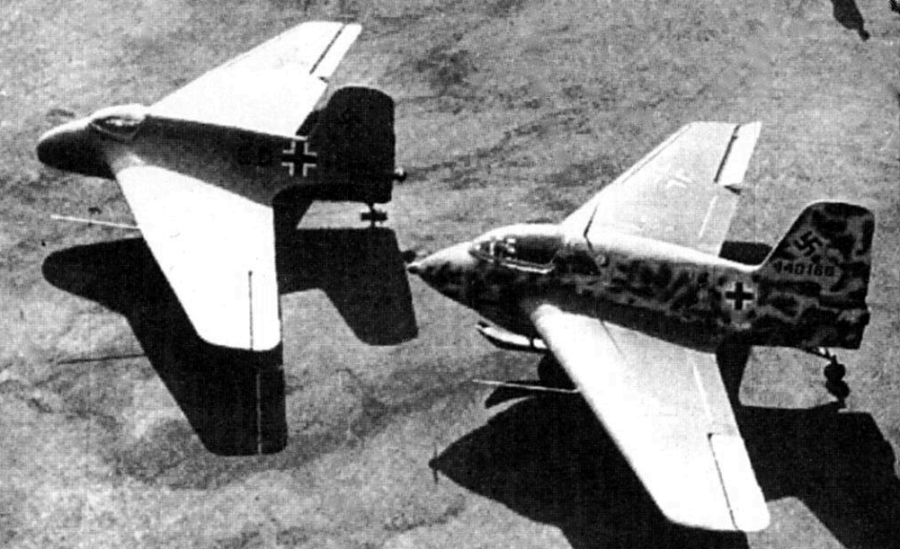

### 空军的火箭引擎

*本文非原著正文，为译者所写的番外篇。*

> *自从联盟和部落并肩作战，共同抵抗燃烧军团的入侵，已经过去了四年。尽管成功地挽救了艾泽拉斯大陆，部落和联盟之间脆弱的协议却早已荡然无存。如今，震天的战鼓再一次响起。*

> *——《佩内明德之空军独立宣言》*

　　由于一战凡尔赛和约的限制，德国空军一直在航空部的掩护下，作为隐匿的军事单位存在。直到1935年，纳粹撕毁和约后，公开了空军的存在，并在帝国二号人物戈林的带领下，开始迅猛发展。但作为一个新生的军种，论积累论底蕴，空军都没有办法与陆军较量，更何况有与陆军叫板的冲锋队的前车之鉴，空军的策略是弯道超车。新生军种是空军的弱点，但从另一方面来讲，也是空军的优势，新生意味着没有陆军那么多繁冗的官僚作风，意味着没有老派军官那样的保守主义。所以，空军非常热衷于激进的新技术，而从空军的本行的角度来说，他们的目光自然而然地聚焦到了推进技术上。

　　推进技术是现代飞机技术的根本，就如同我们总说：航空发动机是国家制造业的明珠。在二战时期，活塞式引擎、螺旋桨战机在德国空军看来已经落后，德国空军勇猛地拥抱所有可能的技术。冲压发动机、涡喷发动机以及火箭发动机。在空军手上，冲压发动机装备世界首款巡航导弹——V-1，涡喷发动机装备二战中最成功的实战型喷气战斗机——Me 262，火箭发动机则装备世界首款实战航天战机——Me 163。前二者本文不做展开，本文将主要论述空军的火箭发动机。

　　提到火箭引擎，就不能不说V-2，这是现代火箭的开山鼻祖。1934年末，德国陆军A-2（V-2的陆军代号是A-4）试射成功，陆军在1935年初，进行了成果展示，这吸引了空军的目光。后来晋升空军元帅的冯•里希特霍芬正掌管航空部技术办公室，他一眼看到了飞机上装备火箭引擎的巨大军事潜力。作为“暴发户”的空军，立即投入巨资，与陆军共建佩内明德实验中心。空军的目标是与陆军合作研发火箭飞机，即将A-2的引擎移植到飞机上。基建费用双方均摊，空军另外赞助陆军一半的研发费用，考虑到陆军主要在佩内明德研发A-4引擎，移植A-2并不是主业，空军的条件可谓相当优厚。

　　虽然空军在佩内明德上投入了巨量的资源，但是冲突很快浮出水面。导火索就是陆军谋求垄断火箭技术的野心，空军作为一个有抱负有能力的军种，肯定不会甘心受制于人。加上里希特霍芬很快离开技术办公室，与陆军的合作很快名存实亡破裂。空军开始撇开陆军单干，这其中的关键人物就是赫尔穆特•瓦尔特（1900-1980）。题外话，在陆空联盟破裂后，空军与陆军的竞争无时无刻不在进行，最直接最能威胁陆军V-2的项目是代号樱桃石的V-1，从研发到量产，优先权的争夺从未停止。间接的则是本文的火箭飞机项目，撇开陆军后，空军不仅搞出来了自己的火箭引擎，而且干得还不错。

　　瓦尔特主要从事过氧化氢火箭引擎的研发，过氧化氢引擎在推力和性能上不如V-2的乙醇/液氧引擎，但过氧化氢引擎的适用范围远远大于重型的v-2引擎。瓦尔特引擎分为冷引擎和热引擎，冷引擎使用催化剂，将过氧化氢分解成超高温水蒸气和氧气；热引擎则将过氧化氢与燃料燃烧，产生更大推力。下图是瓦尔特109-509.A-2引擎设计图，此款引擎为“热引擎”，即双推进剂过氧化氢+碳氢燃料的组合，图中的[T-STOFF](https://en.wikipedia.org/wiki/T-Stoff)即过氧化氢，[C-STOFF](https://en.wikipedia.org/wiki/C-Stoff)即碳氢燃料。设计图的左半部分为涡轮泵和蒸汽发生器，主要用来泵取燃料以及氧化剂。驱动涡轮泵的蒸汽发生器，也采用过氧化氢作为能量来源。右上方的飞行员阀门可以控制燃烧室的推进剂进入量，从而控制推力，图中这款引擎的推力范围150-1,700kg。引擎燃烧室采用了再生冷却技术，C-STOFF燃料进入燃烧室之前，先通过燃烧室外的夹层套管，可以对燃烧室进行有效地冷却。虽然增加了管线，但这是最简单有效的冷却方案。*[来源](http://www.walterwerke.co.uk/walter/me163b5.htm)*

　　瓦尔特引擎最终装备于著名的梅塞施米特Me 163系列火箭飞机。下图前者为Me 163A原型机，后者为Me 163B量产型。Me 163采用了三角翼和无尾翼的设计，称之为火箭滑翔机更为合适。Me 163的战绩和飞行员体验都相当糟糕，但它是世界首款实战航天战机。虽然火箭引擎只能工作数分钟，但凭借强劲的推力，me 163B速度可以达到900公里/时，远大于当时的盟国战机。

　　瓦尔特引擎直到德国战败前，一直处于高速发展当中。下表为其系列型号参数，*[来源](http://www.walterwerke.co.uk/walter/motors.htm)*。瓦尔特引擎S系列还用在了Me. 262喷气式飞机上。理论上，喷气式使用涡喷发动机，那么使用火箭引擎是为什么呢？答案是助推器。火箭助推可以极大的提高飞机的爬升速度，在拦截盟军轰炸机编队时，迅速占据有利位置。Me. 262C系列就是这个思路的产物。109-509.S-1应用于Me 262C-1a，将引擎安装于飞机尾部，并将靠近瓦尔特引擎喷口处的垂尾根部进行了了修形。Me 262C-1a只造出了一架原型机，在瓦尔特火箭引擎的帮助下，起飞距离缩短200米，爬升到万米高度仅需要三分多钟。因为内置火箭引擎，大大减少了涡喷发动机燃料的携带空间，所以有了Me 262C-3这一改进型号，将瓦尔特引擎吊装在机腹下，完成截击任务后丢弃并使用降落伞回收，S-2引擎已经完成，原型机尚未完成，位于延巴赫的生产工厂即被盟军占领。

| 型号   |  	推力   |  	装备   |  	重量   |  	备注   |
| ----   |  ----    |  	-------   |  -------   |  	------- |
| RII.203 |150-750 kg  |  	Me. 163A      |  -     |   冷引擎|
| 109-509.A-0  | 150-1500 kg  |Me. 163B  | 170 kg |   热引擎原型,1943年首飞|
| 109-509.A-1  | 150-1500 kg  |Me. 163B  | 170 kg |   最早量产的热引擎，电启动|
| 109-509.A-2  | 150-1700 kg  |Me. 163B  | 160 kg |   A-1发展型，T-STOFF启动|
| 109-509.B  | 150-1700+ 100-300 kg  |Me. 163B  | 201 kg |   A-1，额外的巡航燃烧室，只生产了十台|
| 109-509.C  | 150-2000 + 100-400 kg |Me. 263  | 180 kg  kg |   A-2，额外的巡航燃烧室，主燃烧室达到24个大气压|
| 109-509.D  | 150-1700 kg  |DFS Sagefisch   | 170 kg |A-2,引擎拆分成三大部分安装   |
| 109-509.A-2E  | 150-1700 kg  |Ba. Natter    | 160 kg | 引擎部件重新布局，适应垂直发射  |
| 109-509.S-1   | 150-1700 kg  |Me. 262  | 160 kg |   A-2发展型 |
| 109-509.S-2   | Max. 2000 kg |Me. 262  | 140 kg |   - |

